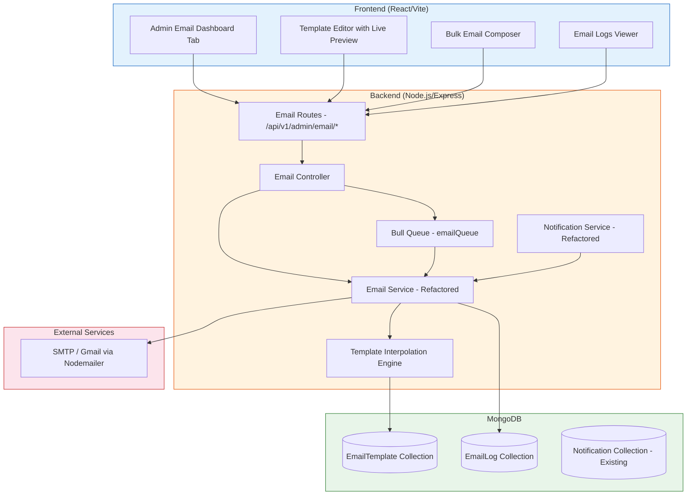
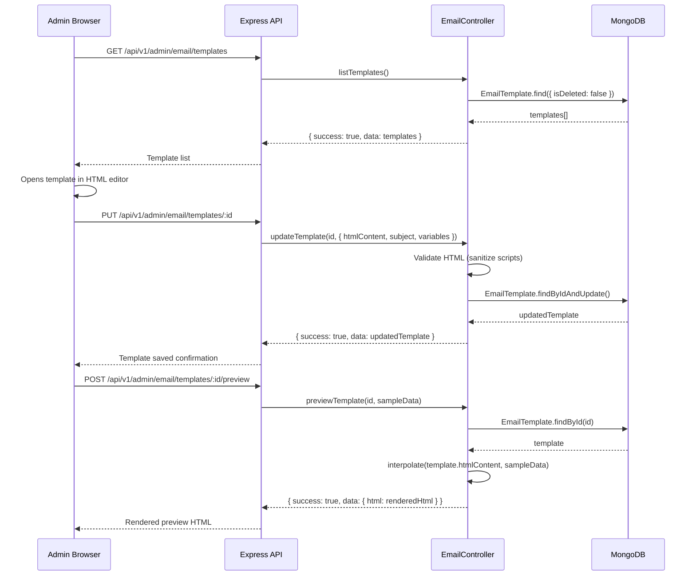
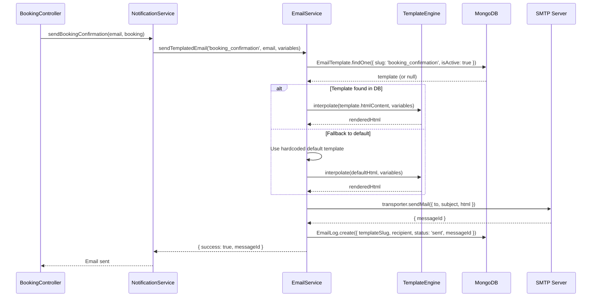
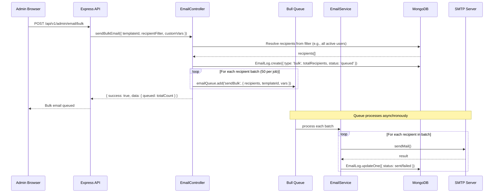

# Design Document: Email Management System

## Overview

The Email Management System transforms Telitrip's current hardcoded email infrastructure into a dynamic, admin-managed email platform. Currently, all 11+ email templates are inline HTML strings scattered across `notification.service.js` and `email.templates.js`, with no admin UI, no delivery tracking, and a stub bulk-email endpoint. This design introduces MongoDB-backed email templates with an admin HTML editor, live preview, dynamic variable interpolation (`{{userName}}`, `{{bookingId}}`, etc.), delivery logging, bulk email via the existing Bull queue, and a professional Telitrip-branded template system matching the app's blue/white theme. The system reuses existing dependencies (nodemailer, mongoose, bull, express-validator) with zero new npm packages.

The architecture layers a new `EmailTemplate` model and `EmailLog` model in MongoDB, a refactored `email.service.js` that resolves templates from the database with fallback to defaults, a Bull-queue-powered bulk sender, and a React admin UI with a code editor and live preview panel integrated into the existing `AdminDashboard.jsx` tab navigation.

## Architecture



## Sequence Diagrams

### Admin Edits and Saves a Template



### Sending a Transactional Email (e.g., Booking Confirmation)



### Bulk Email via Bull Queue



## Components and Interfaces

### Component 1: EmailTemplate Model

**Purpose**: Stores email templates in MongoDB so admins can edit them via UI without code changes.

**Interface**:
```javascript
// models/emailTemplate.model.js
const emailTemplateSchema = new mongoose.Schema({
  name: { type: String, required: true, trim: true, maxLength: 200 },
  slug: { type: String, required: true, unique: true, lowercase: true, trim: true },
  category: {
    type: String,
    enum: ['booking', 'payment', 'account', 'support', 'marketing', 'system'],
    required: true,
    index: true
  },
  subject: { type: String, required: true, trim: true, maxLength: 500 },
  htmlContent: { type: String, required: true },
  textContent: { type: String },
  variables: [{
    key: { type: String, required: true },      // e.g., 'userName'
    description: { type: String },               // e.g., 'Customer first name'
    defaultValue: { type: String, default: '' },
    required: { type: Boolean, default: false }
  }],
  sampleData: { type: mongoose.Schema.Types.Mixed },  // For live preview
  isActive: { type: Boolean, default: true, index: true },
  isDefault: { type: Boolean, default: false },  // System templates can't be deleted
  isDeleted: { type: Boolean, default: false },
  version: { type: Number, default: 1 },
  lastEditedBy: { type: mongoose.Schema.Types.ObjectId, ref: 'User' },
  metadata: {
    sendCount: { type: Number, default: 0 },
    lastSentAt: { type: Date }
  }
}, { timestamps: true });
```

**Responsibilities**:
- Store template HTML content, subject lines, and variable definitions
- Track template versions and edit history
- Categorize templates for admin filtering
- Provide sample data for live preview rendering
- Soft-delete support (isDeleted flag) to preserve audit trail

### Component 2: EmailLog Model

**Purpose**: Tracks every email sent for delivery monitoring, debugging, and admin reporting.

**Interface**:
```javascript
// models/emailLog.model.js
const emailLogSchema = new mongoose.Schema({
  templateSlug: { type: String, index: true },
  templateName: { type: String },
  recipient: { type: String, required: true, index: true },
  recipientUserId: { type: mongoose.Schema.Types.ObjectId, ref: 'User', index: true },
  subject: { type: String, required: true },
  status: {
    type: String,
    enum: ['queued', 'sent', 'delivered', 'failed', 'bounced'],
    default: 'queued',
    index: true
  },
  type: {
    type: String,
    enum: ['transactional', 'bulk', 'system'],
    default: 'transactional',
    index: true
  },
  messageId: { type: String },
  error: { type: String },
  metadata: {
    bulkJobId: { type: String },
    variables: { type: mongoose.Schema.Types.Mixed },
    ipAddress: { type: String }
  },
  sentAt: { type: Date },
  deliveredAt: { type: Date }
}, { timestamps: true });

emailLogSchema.index({ createdAt: -1 });
emailLogSchema.index({ status: 1, createdAt: -1 });
```

**Responsibilities**:
- Log every email send attempt with status tracking
- Associate logs with templates and users for reporting
- Store error details for failed deliveries
- Support pagination and filtering in admin logs viewer
- TTL index option for auto-cleanup of old logs (configurable)

### Component 3: Email Service (Refactored)

**Purpose**: Central email sending service that resolves templates from MongoDB, interpolates variables, sends via Nodemailer, and logs results.

**Interface**:
```javascript
// services/email.service.js (refactored)
class EmailService {
  constructor() { /* Nodemailer transporter setup */ }

  // Core: Send email using a DB template with variable interpolation
  async sendTemplatedEmail(templateSlug, recipientEmail, variables, options = {}) {}

  // Core: Send raw HTML email (backward compat)
  async sendEmail({ to, subject, html, text }) {}

  // Template resolution: DB first, fallback to defaults
  async resolveTemplate(slug) {}

  // Variable interpolation: {{varName}} replacement with escaping
  interpolate(htmlContent, variables) {}

  // Bulk: Queue emails via Bull
  async queueBulkEmail(templateId, recipients, customVariables) {}

  // Logging
  async logEmail(logData) {}

  // Stats
  async getEmailStats(dateRange) {}
}
```

**Responsibilities**:
- Resolve templates from MongoDB with fallback to hardcoded defaults
- Interpolate `{{variable}}` placeholders with HTML-escaped values
- Send emails via existing Nodemailer SMTP transporter
- Log every send to EmailLog collection
- Queue bulk emails through Bull for rate-limited async processing
- Provide delivery statistics for admin dashboard

### Component 4: Email Controller & Routes

**Purpose**: REST API endpoints for admin email management operations.

**Interface**:
```javascript
// controllers/email.controller.js
class EmailController {
  // Template CRUD
  async listTemplates(req, res) {}       // GET    /api/v1/admin/email/templates
  async getTemplate(req, res) {}         // GET    /api/v1/admin/email/templates/:id
  async createTemplate(req, res) {}      // POST   /api/v1/admin/email/templates
  async updateTemplate(req, res) {}      // PUT    /api/v1/admin/email/templates/:id
  async deleteTemplate(req, res) {}      // DELETE /api/v1/admin/email/templates/:id
  async duplicateTemplate(req, res) {}   // POST   /api/v1/admin/email/templates/:id/duplicate

  // Preview & Test
  async previewTemplate(req, res) {}     // POST   /api/v1/admin/email/templates/:id/preview
  async sendTestEmail(req, res) {}       // POST   /api/v1/admin/email/templates/:id/test

  // Bulk Email
  async sendBulkEmail(req, res) {}       // POST   /api/v1/admin/email/bulk

  // Logs & Stats
  async getEmailLogs(req, res) {}        // GET    /api/v1/admin/email/logs
  async getEmailStats(req, res) {}       // GET    /api/v1/admin/email/stats

  // Seed defaults
  async seedDefaultTemplates(req, res) {}// POST   /api/v1/admin/email/templates/seed
}
```

**Responsibilities**:
- CRUD operations for email templates with validation
- HTML sanitization (strip `<script>` tags, event handlers)
- Template preview with sample data interpolation
- Test email sending to admin's own address
- Bulk email orchestration with recipient filtering
- Email log retrieval with pagination and filtering
- Dashboard statistics aggregation

### Component 5: Admin Email UI (React)

**Purpose**: Admin dashboard tab for managing email templates, composing bulk emails, and viewing delivery logs.

**Interface**:
```javascript
// Frontend components structure
// components/EmailManagement/
//   EmailManagementTab.jsx      - Main tab container with sub-navigation
//   TemplateList.jsx            - Grid/list of templates with category filters
//   TemplateEditor.jsx          - HTML editor + live preview split panel
//   BulkEmailComposer.jsx       - Recipient selection + template picker + send
//   EmailLogsViewer.jsx         - Paginated log table with status filters
//   EmailStatsCards.jsx         - Delivery stats summary cards
//   TemplatePreview.jsx         - Iframe-based rendered preview
//   VariableInserter.jsx        - Clickable variable chips for editor
```

**Responsibilities**:
- Template list with category filtering and search
- Split-panel HTML editor (textarea/contenteditable) with live preview in iframe
- Variable insertion helper showing available `{{variables}}` as clickable chips
- Bulk email composer with user segment selection (all users, active users, by booking status)
- Email logs table with status badges, date filtering, and pagination
- Stats cards showing sent/delivered/failed counts
- Responsive design matching existing admin dashboard patterns

## Data Models

### EmailTemplate

```javascript
{
  _id: ObjectId,
  name: "Booking Confirmation",
  slug: "booking_confirmation",
  category: "booking",
  subject: "Booking Confirmed - {{bookingReference}}",
  htmlContent: "<html>...{{userName}}...{{bookingReference}}...</html>",
  textContent: "Hi {{userName}}, your booking {{bookingReference}} is confirmed.",
  variables: [
    { key: "userName", description: "Customer first name", required: true },
    { key: "bookingReference", description: "Booking reference code", required: true },
    { key: "hotelName", description: "Hotel name", required: true },
    { key: "checkInDate", description: "Check-in date", required: true },
    { key: "checkOutDate", description: "Check-out date", required: true },
    { key: "totalAmount", description: "Total booking amount", required: true },
    { key: "guests", description: "Number of guests", required: false, defaultValue: "1" },
    { key: "rooms", description: "Number of rooms", required: false, defaultValue: "1" }
  ],
  sampleData: {
    userName: "John",
    bookingReference: "TT-2025-001234",
    hotelName: "Pearl Continental Lahore",
    checkInDate: "July 15, 2025",
    checkOutDate: "July 18, 2025",
    totalAmount: "PKR 45,000",
    guests: "2",
    rooms: "1"
  },
  isActive: true,
  isDefault: true,
  isDeleted: false,
  version: 3,
  lastEditedBy: ObjectId("admin_user_id"),
  metadata: { sendCount: 1247, lastSentAt: ISODate("2025-07-10") },
  createdAt: ISODate("2025-01-01"),
  updatedAt: ISODate("2025-07-10")
}
```

**Validation Rules**:
- `slug` must be unique, lowercase, alphanumeric with underscores only
- `htmlContent` must not contain `<script>` tags or `on*` event attributes
- `subject` supports `{{variable}}` interpolation same as body
- `variables[].key` must match `[a-zA-Z][a-zA-Z0-9_]*` pattern
- `category` must be one of the defined enum values
- Default templates (`isDefault: true`) cannot be hard-deleted, only soft-deleted

### EmailLog

```javascript
{
  _id: ObjectId,
  templateSlug: "booking_confirmation",
  templateName: "Booking Confirmation",
  recipient: "customer@example.com",
  recipientUserId: ObjectId("user_id"),
  subject: "Booking Confirmed - TT-2025-001234",
  status: "sent",
  type: "transactional",
  messageId: "<abc123@smtp.gmail.com>",
  error: null,
  metadata: {
    bulkJobId: null,
    variables: { userName: "John", bookingReference: "TT-2025-001234" }
  },
  sentAt: ISODate("2025-07-10T14:30:00Z"),
  deliveredAt: null,
  createdAt: ISODate("2025-07-10T14:30:00Z")
}
```

**Validation Rules**:
- `recipient` must be a valid email address
- `status` transitions: queued → sent → delivered, or queued → failed, or sent → bounced
- `type` determines whether log appears in transactional or bulk views
- Logs older than 90 days can be auto-archived (configurable TTL)

## Default Template Catalog

The seed operation creates these 12 professional Telitrip-branded templates:

| Slug | Category | Description |
|------|----------|-------------|
| `welcome` | account | New user registration welcome |
| `password_reset` | account | Password reset link |
| `password_changed` | account | Password change confirmation |
| `account_suspended` | account | Account suspension notice |
| `account_reactivated` | account | Account reactivation notice |
| `booking_confirmation` | booking | Booking confirmed with details |
| `booking_cancellation` | booking | Booking cancelled with refund info |
| `booking_status_update` | booking | Generic booking status change |
| `payment_confirmation` | payment | Payment received confirmation |
| `payment_refund` | payment | Refund processed notification |
| `support_ticket_created` | support | New ticket acknowledgment (to customer) |
| `support_ticket_response` | support | Admin response notification (to customer) |

All templates share a consistent Telitrip brand wrapper:
- Header: Blue gradient (`#1a73e8` to `#4285f4`) with Telitrip logo text
- Body: White background, `#333` text, clean card layout
- Footer: Light gray (`#f8f9fa`) with copyright and contact info
- Buttons: Primary blue (`#1a73e8`), rounded corners
- Font: Arial/Helvetica sans-serif stack (email-safe)


## Key Functions with Formal Specifications

### Function 1: sendTemplatedEmail()

```javascript
async sendTemplatedEmail(templateSlug, recipientEmail, variables, options = {}) {
  // Returns { success: boolean, messageId?: string, error?: string }
}
```

**Preconditions:**
- `templateSlug` is a non-empty string matching an existing template slug or a known default
- `recipientEmail` is a valid email address string
- `variables` is a plain object (not null/undefined)
- SMTP transporter is configured and connected
- MongoDB connection is active

**Postconditions:**
- If template found and email sent: returns `{ success: true, messageId }` and an EmailLog document is created with status `'sent'`
- If template not found in DB: falls back to hardcoded default; if no default exists, returns `{ success: false, error: 'Template not found' }`
- If SMTP fails: returns `{ success: false, error }` and an EmailLog document is created with status `'failed'`
- Template's `metadata.sendCount` is incremented and `metadata.lastSentAt` is updated on success
- No mutation to the input `variables` object
- All `{{variable}}` placeholders in both subject and body are replaced; unmatched placeholders are replaced with empty string

**Loop Invariants:** N/A (no loops in core function)

### Function 2: interpolate()

```javascript
interpolate(template, variables) {
  // Returns string with all {{key}} placeholders replaced
}
```

**Preconditions:**
- `template` is a string (may be empty)
- `variables` is a plain object with string-coercible values

**Postconditions:**
- Every `{{key}}` in `template` where `key` exists in `variables` is replaced with the HTML-escaped value of `variables[key]`
- Every `{{key}}` where `key` does NOT exist in `variables` is replaced with empty string `''`
- HTML special characters in variable values (`<`, `>`, `&`, `"`, `'`) are escaped to prevent XSS
- The original `template` string is not mutated (returns new string)
- No nested interpolation: `{{{{nested}}}}` is not recursively resolved

**Loop Invariants:**
- For regex global replace: each match is processed exactly once, left to right

### Function 3: resolveTemplate()

```javascript
async resolveTemplate(slug) {
  // Returns { template: EmailTemplateDoc | null, isDefault: boolean }
}
```

**Preconditions:**
- `slug` is a non-empty lowercase string
- MongoDB connection is active

**Postconditions:**
- If an active, non-deleted template with matching slug exists in DB: returns `{ template: doc, isDefault: false }`
- If no DB template found but a hardcoded default exists for this slug: returns `{ template: defaultDoc, isDefault: true }`
- If neither exists: returns `{ template: null, isDefault: false }`
- DB query uses `{ slug, isActive: true, isDeleted: false }` filter
- No side effects on database

### Function 4: queueBulkEmail()

```javascript
async queueBulkEmail(templateId, recipientFilter, customVariables = {}) {
  // Returns { success: boolean, queued: number, jobIds: string[] }
}
```

**Preconditions:**
- `templateId` is a valid MongoDB ObjectId referencing an active EmailTemplate
- `recipientFilter` is an object with optional fields: `{ segment: 'all'|'active'|'inactive', userIds?: ObjectId[] }`
- Bull queue (`emailQueue`) is connected to Redis
- At least one recipient matches the filter

**Postconditions:**
- Recipients are resolved from the filter and batched into groups of 50
- Each batch is added to the Bull queue as a separate job with `{ attempts: 3, backoff: { type: 'exponential', delay: 5000 } }`
- An EmailLog entry with `type: 'bulk'` and `status: 'queued'` is created for each recipient
- Returns total count of queued recipients and array of Bull job IDs
- If template not found or inactive: returns `{ success: false, error: 'Template not found or inactive' }`
- If no recipients match filter: returns `{ success: false, error: 'No recipients found' }`

**Loop Invariants:**
- For batching loop: `totalQueued` equals the sum of all batch sizes processed so far
- Each recipient appears in exactly one batch

### Function 5: sanitizeHtml()

```javascript
sanitizeHtml(htmlContent) {
  // Returns sanitized HTML string safe for email templates
}
```

**Preconditions:**
- `htmlContent` is a string (may contain arbitrary HTML)

**Postconditions:**
- All `<script>` and `</script>` tags and their contents are removed
- All `on*` event handler attributes (onclick, onload, onerror, etc.) are removed
- All `javascript:` protocol URLs are removed
- Valid HTML structure, inline styles, and email-safe tags are preserved
- Returns a new string; input is not mutated

## Algorithmic Pseudocode

### Template Interpolation Algorithm

```javascript
/**
 * ALGORITHM interpolate(template, variables)
 * INPUT: template (string with {{key}} placeholders), variables (object)
 * OUTPUT: rendered string with all placeholders replaced
 *
 * PRECONDITION: template is a string, variables is a plain object
 * POSTCONDITION: all {{key}} replaced with escaped values or empty string
 */
function interpolate(template, variables) {
  if (!template) return '';
  if (!variables || typeof variables !== 'object') return template;

  // ASSERT: template is string, variables is object

  return template.replace(/\{\{(\w+)\}\}/g, (match, key) => {
    // INVARIANT: each match processed exactly once, left to right
    const value = variables[key];
    if (value === undefined || value === null) return '';
    return escapeHtml(String(value));
  });
}

function escapeHtml(str) {
  const escapeMap = {
    '&': '&amp;',
    '<': '&lt;',
    '>': '&gt;',
    '"': '&quot;',
    "'": '&#x27;'
  };
  return str.replace(/[&<>"']/g, char => escapeMap[char]);
}
```

### Template Resolution with Fallback Algorithm

```javascript
/**
 * ALGORITHM resolveTemplate(slug)
 * INPUT: slug (string, e.g., 'booking_confirmation')
 * OUTPUT: { template, isDefault }
 *
 * PRECONDITION: slug is non-empty lowercase string
 * POSTCONDITION: returns DB template, or hardcoded default, or null
 */
async function resolveTemplate(slug) {
  // Step 1: Try database first
  const dbTemplate = await EmailTemplate.findOne({
    slug: slug,
    isActive: true,
    isDeleted: false
  });

  if (dbTemplate) {
    return { template: dbTemplate, isDefault: false };
  }

  // Step 2: Fallback to hardcoded defaults
  const defaults = getDefaultTemplates();
  const defaultTemplate = defaults[slug];

  if (defaultTemplate) {
    return { template: defaultTemplate, isDefault: true };
  }

  // Step 3: No template found
  return { template: null, isDefault: false };
}
```

### Bulk Email Queue Processing Algorithm

```javascript
/**
 * ALGORITHM processBulkEmailBatch(job)
 * INPUT: job.data = { recipients[], templateId, customVariables }
 * OUTPUT: { sent: number, failed: number }
 *
 * PRECONDITION: job contains valid recipients and templateId
 * POSTCONDITION: all recipients processed, logs updated
 * LOOP INVARIANT: sent + failed + remaining = total recipients
 */
async function processBulkEmailBatch(job) {
  const { recipients, templateId, customVariables } = job.data;
  const template = await EmailTemplate.findById(templateId);

  let sent = 0;
  let failed = 0;

  for (const recipient of recipients) {
    // INVARIANT: sent + failed + (recipients.length - indexOf(recipient) - 1) = total
    try {
      const variables = {
        ...customVariables,
        userName: recipient.firstName || 'Customer',
        userEmail: recipient.email
      };

      const html = interpolate(template.htmlContent, variables);
      const subject = interpolate(template.subject, variables);

      await transporter.sendMail({
        from: `${process.env.FROM_NAME} <${process.env.FROM_EMAIL}>`,
        to: recipient.email,
        subject,
        html,
        text: html.replace(/<[^>]*>/g, '')
      });

      await EmailLog.updateOne(
        { recipient: recipient.email, 'metadata.bulkJobId': job.id },
        { $set: { status: 'sent', sentAt: new Date() } }
      );

      sent++;

      // Rate limiting: 100ms delay between emails to avoid SMTP throttling
      await new Promise(resolve => setTimeout(resolve, 100));
    } catch (error) {
      await EmailLog.updateOne(
        { recipient: recipient.email, 'metadata.bulkJobId': job.id },
        { $set: { status: 'failed', error: error.message } }
      );
      failed++;
    }
  }

  // ASSERT: sent + failed === recipients.length
  return { sent, failed };
}
```

### HTML Sanitization Algorithm

```javascript
/**
 * ALGORITHM sanitizeHtml(htmlContent)
 * INPUT: htmlContent (string, potentially unsafe HTML)
 * OUTPUT: sanitized HTML string
 *
 * PRECONDITION: htmlContent is a string
 * POSTCONDITION: no script tags, no event handlers, no javascript: URLs
 */
function sanitizeHtml(htmlContent) {
  if (!htmlContent) return '';

  let sanitized = htmlContent;

  // Step 1: Remove script tags and contents
  sanitized = sanitized.replace(/<script\b[^<]*(?:(?!<\/script>)<[^<]*)*<\/script>/gi, '');

  // Step 2: Remove on* event handler attributes
  sanitized = sanitized.replace(/\s+on\w+\s*=\s*(?:"[^"]*"|'[^']*'|[^\s>]+)/gi, '');

  // Step 3: Remove javascript: protocol URLs
  sanitized = sanitized.replace(/href\s*=\s*["']?\s*javascript:/gi, 'href="');
  sanitized = sanitized.replace(/src\s*=\s*["']?\s*javascript:/gi, 'src="');

  return sanitized;
}
```

## Example Usage

### Backend: Sending a Templated Email

```javascript
const emailService = require('./services/email.service');

// Transactional email - booking confirmation
await emailService.sendTemplatedEmail('booking_confirmation', 'customer@example.com', {
  userName: 'Ahmed',
  bookingReference: 'TT-2025-001234',
  hotelName: 'Pearl Continental Lahore',
  checkInDate: 'July 15, 2025',
  checkOutDate: 'July 18, 2025',
  totalAmount: 'PKR 45,000',
  guests: '2',
  rooms: '1'
});

// Bulk email - marketing campaign
await emailService.queueBulkEmail(
  '668abc123def456789012345',  // templateId
  { segment: 'active' },        // all active users
  { promoCode: 'SUMMER25', discount: '25%' }
);
```

### Backend: Notification Service Integration

```javascript
// notification.service.js (refactored)
async sendBookingConfirmation(email, booking) {
  return await emailService.sendTemplatedEmail('booking_confirmation', email, {
    userName: booking.userId.firstName,
    bookingReference: booking.bookingReference,
    hotelName: booking.hotelId.name,
    checkInDate: new Date(booking.checkInDate).toLocaleDateString(),
    checkOutDate: new Date(booking.checkOutDate).toLocaleDateString(),
    totalAmount: `PKR ${booking.totalAmount}`,
    guests: String(booking.guests),
    rooms: String(booking.rooms)
  });
}
```

### Frontend: Template Editor Component

```javascript
// components/EmailManagement/TemplateEditor.jsx
import React, { useState, useEffect } from 'react';

const TemplateEditor = ({ templateId, onSave }) => {
  const [template, setTemplate] = useState(null);
  const [htmlContent, setHtmlContent] = useState('');
  const [previewHtml, setPreviewHtml] = useState('');

  const handlePreview = async () => {
    const res = await fetch(`/api/v1/admin/email/templates/${templateId}/preview`, {
      method: 'POST',
      headers: { 'Content-Type': 'application/json' },
      body: JSON.stringify({ htmlContent, sampleData: template.sampleData })
    });
    const data = await res.json();
    setPreviewHtml(data.data.html);
  };

  const insertVariable = (varKey) => {
    setHtmlContent(prev => prev + `{{${varKey}}}`);
  };

  return (
    <div className="grid grid-cols-2 gap-4">
      {/* Left: Editor */}
      <div>
        <div className="flex gap-2 mb-2">
          {template?.variables?.map(v => (
            <button key={v.key} onClick={() => insertVariable(v.key)}
              className="px-2 py-1 bg-blue-100 text-blue-700 rounded text-sm">
              {`{{${v.key}}}`}
            </button>
          ))}
        </div>
        <textarea value={htmlContent} onChange={e => setHtmlContent(e.target.value)}
          className="w-full h-96 font-mono text-sm border rounded p-3" />
      </div>
      {/* Right: Live Preview */}
      <div>
        <iframe srcDoc={previewHtml} className="w-full h-96 border rounded" sandbox="" />
      </div>
    </div>
  );
};
```

### Admin API: Template CRUD

```javascript
// GET /api/v1/admin/email/templates?category=booking&search=confirm
// Response:
{
  "success": true,
  "data": {
    "templates": [
      {
        "_id": "668abc...",
        "name": "Booking Confirmation",
        "slug": "booking_confirmation",
        "category": "booking",
        "subject": "Booking Confirmed - {{bookingReference}}",
        "isActive": true,
        "isDefault": true,
        "metadata": { "sendCount": 1247, "lastSentAt": "2025-07-10T..." },
        "updatedAt": "2025-07-10T..."
      }
    ],
    "pagination": { "page": 1, "limit": 20, "total": 4, "pages": 1 }
  }
}
```

## Correctness Properties

*A property is a characteristic or behavior that should hold true across all valid executions of a system — essentially, a formal statement about what the system should do. Properties serve as the bridge between human-readable specifications and machine-verifiable correctness guarantees.*

### Property 1: Interpolation Completeness

*For any* template string containing `{{key}}` placeholders and *any* variables object, after interpolation no `{{...}}` patterns remain in the output. All matched keys are replaced with their HTML-escaped values, and all unmatched keys are replaced with empty strings.

**Validates: Requirements 4.1, 4.2**

### Property 2: HTML Escape Safety

*For any* variable value containing HTML special characters (`<`, `>`, `&`, `"`, `'`), after interpolation into a template, the output contains only the escaped equivalents (`&lt;`, `&gt;`, `&amp;`, `&quot;`, `&#x27;`) and never the raw characters from the variable values.

**Validates: Requirement 4.3**

### Property 3: Interpolation Immutability

*For any* template string and *any* variables object, calling `interpolate(template, variables)` does not mutate the original template string or the variables object.

**Validates: Requirement 4.5**

### Property 4: Sanitization Safety

*For any* HTML string, after applying `sanitizeHtml()`, the output contains no `<script>` tags, no `on*` event handler attributes, and no `javascript:` protocol URLs.

**Validates: Requirements 6.1, 6.2, 6.3**

### Property 5: Sanitization Idempotency

*For any* HTML string, `sanitizeHtml(sanitizeHtml(x))` produces identical output to `sanitizeHtml(x)`.

**Validates: Requirement 6.5**

### Property 6: Safe HTML Preservation

*For any* HTML string that contains no `<script>` tags, no `on*` event handler attributes, and no `javascript:` protocol URLs, applying `sanitizeHtml()` returns the input unchanged.

**Validates: Requirement 6.4**

### Property 7: Template Resolution Filtering

*For any* set of EmailTemplate documents with varying `isActive` and `isDeleted` states, `resolveTemplate(slug)` only returns templates where `isActive` is `true` and `isDeleted` is `false`.

**Validates: Requirements 3.4, 8.3**

### Property 8: Seed Idempotency

*For any* number of consecutive seed operation executions, the resulting set of templates in the database contains exactly 12 templates matched by slug with no duplicates.

**Validates: Requirements 7.2, 7.5**

### Property 9: EmailTemplate Input Validation

*For any* string provided as a slug, the EmailTemplate_Model accepts it only if it matches `[a-z0-9_]+`. *For any* string provided as a category, the model accepts it only if it is one of the six valid enum values. *For any* string provided as a variable key, the model accepts it only if it matches `[a-zA-Z][a-zA-Z0-9_]*`.

**Validates: Requirements 1.2, 1.3, 1.4**

### Property 10: Log Completeness

*For any* call to `sendTemplatedEmail()` that reaches the send phase (template resolved successfully), exactly one EmailLog document is created, regardless of whether the SMTP send succeeds or fails.

**Validates: Requirement 2.1**

### Property 11: Bulk Email Consistency

*For any* bulk email job with N recipients, after processing completes, the count of sent logs plus the count of failed logs equals N, and exactly N EmailLog entries with type `bulk` exist for that job.

**Validates: Requirements 10.3, 10.6**

### Property 12: Bulk Recipient Batching

*For any* positive integer N representing the number of recipients, the bulk email system creates exactly `ceil(N / 50)` queue jobs, each containing at most 50 recipients, and every recipient appears in exactly one batch.

**Validates: Requirement 10.2**

## Error Handling

### Error Scenario 1: SMTP Connection Failure

**Condition**: Nodemailer transporter fails to connect to SMTP server (network issue, invalid credentials, Gmail rate limit)
**Response**: Email send returns `{ success: false, error: 'SMTP connection failed' }`. EmailLog created with `status: 'failed'` and error details.
**Recovery**: For transactional emails, the calling service can retry once. For bulk emails, Bull queue retries up to 3 times with exponential backoff (5s, 10s, 20s). Admin sees failed status in logs.

### Error Scenario 2: Template Not Found

**Condition**: `sendTemplatedEmail()` called with a slug that has no DB template and no hardcoded default
**Response**: Returns `{ success: false, error: 'Template not found: {slug}' }`. No email sent, no log created.
**Recovery**: Admin is notified via console error. The calling code should handle the failure gracefully (e.g., booking still proceeds, email is skipped with a warning log).

### Error Scenario 3: Invalid Template HTML (XSS Attempt)

**Condition**: Admin saves template with `<script>` tags or `onclick` handlers
**Response**: HTML is sanitized server-side before save. Dangerous content is stripped silently. Template saves successfully with clean HTML.
**Recovery**: No recovery needed — sanitization is automatic. Admin sees the cleaned version on next load.

### Error Scenario 4: Bulk Email Partial Failure

**Condition**: Some recipients in a bulk batch fail (invalid email, mailbox full) while others succeed
**Response**: Each recipient's EmailLog is updated individually. Failed entries get `status: 'failed'` with specific error. Successful entries get `status: 'sent'`.
**Recovery**: Admin can view failed recipients in logs and retry failed ones. The bulk job itself is marked complete (not failed) since partial success is expected.

### Error Scenario 5: MongoDB Connection Loss During Template Resolution

**Condition**: Database becomes unavailable while resolving a template for a transactional email
**Response**: `resolveTemplate()` catches the DB error and falls back to hardcoded defaults if available. If no default exists, returns error.
**Recovery**: Hardcoded defaults ensure critical emails (booking confirmation, password reset) still send even during DB outages. Non-critical emails fail gracefully.

### Error Scenario 6: Bull Queue / Redis Unavailable

**Condition**: Redis is down when admin tries to send bulk email
**Response**: `queueBulkEmail()` catches the connection error and returns `{ success: false, error: 'Email queue unavailable' }`.
**Recovery**: Admin sees error message in UI. They can retry when Redis is back. No partial state is created since queue addition is atomic per batch.

## Testing Strategy

### Unit Testing Approach

- **interpolate()**: Test with various variable combinations, missing variables, empty template, special characters, nested braces, HTML in values
- **sanitizeHtml()**: Test with script tags, event handlers, javascript: URLs, valid HTML preservation, edge cases (malformed tags)
- **resolveTemplate()**: Mock MongoDB to test DB hit, fallback to default, and null case
- **EmailLog creation**: Verify log documents are created with correct fields for success and failure cases

**Coverage Goal**: 90%+ for email.service.js, email.controller.js

### Property-Based Testing Approach

**Property Test Library**: fast-check (already available in Node.js ecosystem, no install needed — use jest with inline property generation)

- **Interpolation completeness**: For any random template string and variable object, output contains no `{{...}}` patterns
- **HTML escape roundtrip**: Escaped values never produce valid HTML tags
- **Sanitization idempotency**: `sanitizeHtml(sanitizeHtml(x)) === sanitizeHtml(x)` for any input

### Integration Testing Approach

- **Template CRUD API**: Test full lifecycle (create → read → update → delete) via supertest
- **Bulk email flow**: Mock SMTP, verify queue jobs created, process jobs, verify logs
- **Notification service refactor**: Verify existing email methods still work after refactor to use `sendTemplatedEmail()`
- **Seed operation**: Run seed, verify all 12 templates created, run again, verify no duplicates

## Performance Considerations

- **Bulk email rate limiting**: 100ms delay between individual sends to avoid Gmail SMTP throttling (max ~500/day for Gmail, configurable for other SMTP providers)
- **Batch size**: 50 recipients per Bull queue job to balance memory usage and job granularity
- **Template caching**: Frequently used templates (booking_confirmation, welcome) can be cached in-memory with 5-minute TTL to reduce DB reads. Initial implementation skips caching for simplicity; add if DB queries become a bottleneck.
- **EmailLog TTL index**: Optional MongoDB TTL index on `createdAt` to auto-delete logs older than 90 days, preventing unbounded collection growth
- **Pagination**: All list endpoints (templates, logs) use cursor-based or offset pagination to avoid full collection scans
- **Index strategy**: Compound indexes on `EmailLog { status, createdAt }` and `EmailTemplate { slug, isActive, isDeleted }` for efficient queries

## Security Considerations

- **HTML sanitization**: All template HTML is sanitized on save to remove XSS vectors (script tags, event handlers, javascript: URLs)
- **Variable escaping**: All interpolated values are HTML-escaped to prevent stored XSS via user data (e.g., a user with `<script>` in their name)
- **Admin-only access**: All email management endpoints require `authUser` + `requireRole(['admin', 'super_admin'])` middleware
- **SMTP credentials**: Stored in environment variables, never exposed via API or logs
- **Bulk email abuse prevention**: Rate limit bulk email endpoint (e.g., max 5 bulk operations per hour per admin)
- **Template content validation**: Max `htmlContent` size of 500KB to prevent abuse
- **No arbitrary recipient injection**: Bulk email resolves recipients from DB filters only, not from raw user input

## Dependencies

All dependencies are already installed in the project — no new npm packages required:

| Dependency | Usage | Already Installed |
|-----------|-------|-------------------|
| `nodemailer` | SMTP email sending | ✅ v6.9.7 |
| `mongoose` | EmailTemplate & EmailLog models | ✅ v8.0.3 |
| `mongoose-paginate-v2` | Paginated queries for templates/logs | ✅ v1.9.1 |
| `bull` | Async bulk email queue | ✅ v4.12.2 |
| `express-validator` | Request validation for email routes | ✅ v7.0.1 |
| `ioredis` | Redis connection for Bull queue | ✅ v5.3.2 |
| `lucide-react` | Icons for email management UI | ✅ v0.511.0 |
| `recharts` | Email stats charts | ✅ v3.3.0 |
| `tailwindcss` | Styling for email management components | ✅ v4.1.7 |
