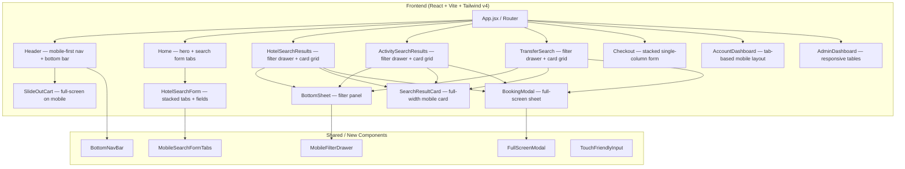
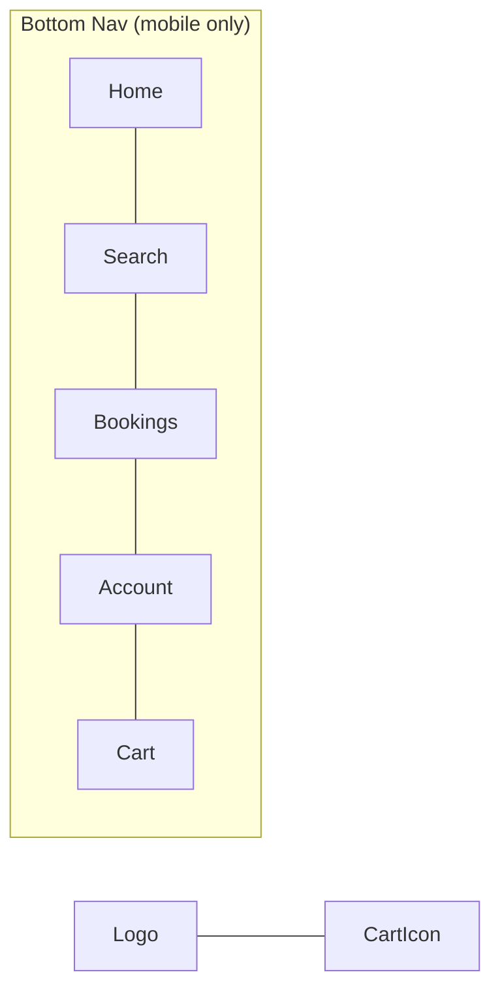
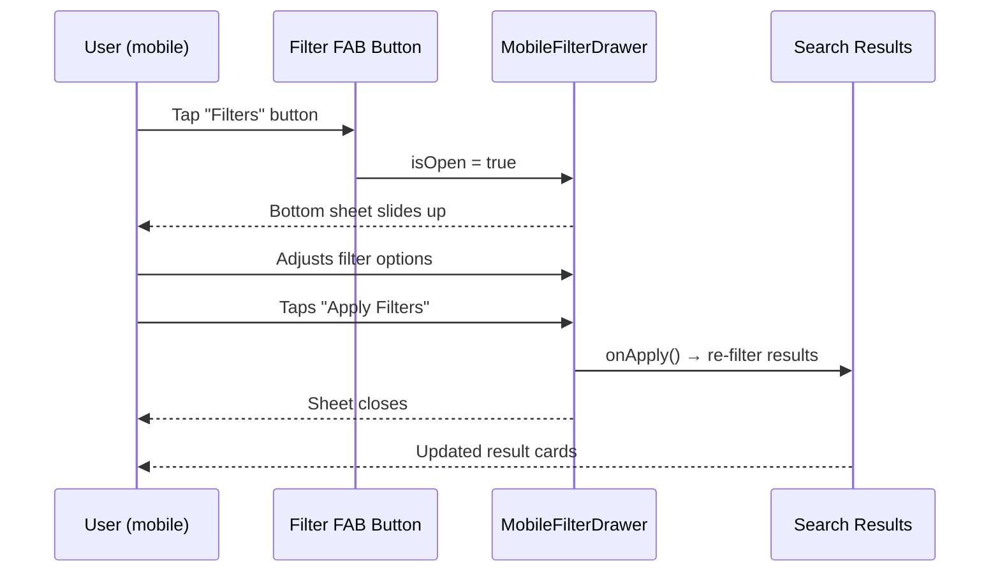
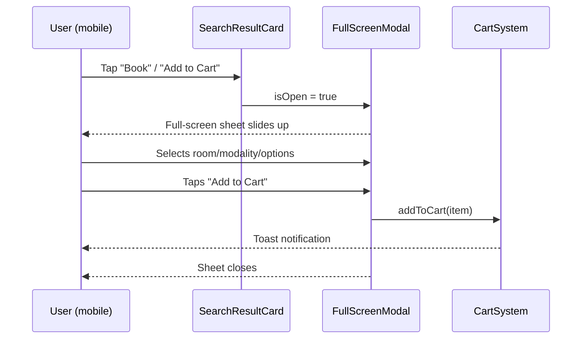
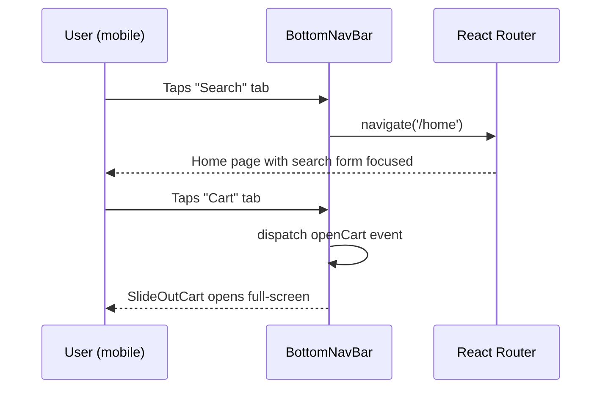

# Design Document: Mobile UX Overhaul

## Overview

TeleTrip is a full-stack React/Vite travel booking platform currently built desktop-first. This overhaul redesigns every user-facing surface for mobile — from the homepage hero and search form through search results, booking modals, cart, checkout, and account dashboard — using a mobile-first responsive approach with Tailwind CSS v4, while preserving all existing desktop layouts and functionality.

The strategy is additive: new mobile-specific layout classes and components are layered on top of the existing codebase. No backend changes are required. The result is a consistent, touch-optimised experience across all breakpoints (≥320 px) without breaking the desktop experience.

## Architecture

The overhaul touches only the Frontend layer. All API contracts, routing, state management (CartProvider, UserProvider, CurrencyContext), and backend services remain unchanged.



## Components and Interfaces

### 1. Header + BottomNavBar

**Purpose**: Replace the cramped mobile hamburger menu with a persistent bottom navigation bar on small screens. The top header retains logo and cart icon only on mobile.

**Interface**:
```jsx
// Header.jsx — mobile top bar (logo + cart badge only)
// BottomNavBar.jsx — new component, fixed bottom, hidden on md+
interface BottomNavBarProps {
  // no props — reads location from react-router useLocation
}
```

**Responsibilities**:
- Top header on mobile: logo left, cart icon with badge right, no hamburger
- `BottomNavBar` fixed at `bottom-0`, `z-[110]`, `pb-safe` (env safe-area-inset-bottom)
- Five tabs: Home, Search, Bookings, Account, Cart
- Active tab highlighted with brand blue
- Hidden on `md:` and above (`hidden md:block` for desktop nav)
- Cart tab shows item count badge

**Mobile layout**:


---

### 2. HotelSearchForm — Mobile Tabs & Fields

**Purpose**: Reflow the three-tab search form (Stays / Experiences / Transfers) from a horizontal desktop layout to a vertically stacked, full-width mobile layout.

**Interface**:
```jsx
// HotelSearchForm.jsx — existing component, responsive additions
// Tab bar: horizontal scroll on mobile, fixed on desktop
// Each tab panel: stacked fields, full-width inputs, 44px min touch targets
```

**Responsibilities**:
- Tab bar uses `overflow-x-auto` horizontal scroll on mobile; no wrapping
- Each input field: `w-full`, `min-h-[44px]`, `text-base` (prevents iOS zoom on focus)
- Date picker: renders as a bottom sheet (`BottomSheet.jsx`) on mobile instead of inline popover
- Guest/traveller picker: bottom sheet on mobile
- Location autocomplete dropdown: full-width, `max-h-60 overflow-y-auto`
- Search CTA button: `w-full` on mobile, fixed width on desktop

---

### 3. MobileFilterDrawer (BottomSheet upgrade)

**Purpose**: Expose sidebar filters on mobile via a swipe-up bottom sheet with an "Apply Filters" sticky footer. Replaces the hidden sidebar on small screens.

**Interface**:
```jsx
interface MobileFilterDrawerProps {
  isOpen: boolean
  onClose: () => void
  title: string
  onApply: () => void
  onReset: () => void
  children: React.ReactNode  // filter sections passed as children
}
```

**Responsibilities**:
- Triggered by a sticky "Filters" FAB button at bottom-right on mobile
- `max-h-[85vh]`, `overflow-y-auto`, `rounded-t-2xl`
- Sticky header with title + close button
- Sticky footer with "Reset" (ghost) and "Apply Filters" (primary) buttons
- Backdrop overlay closes drawer on tap
- Desktop sidebar remains unchanged (`hidden lg:block`)

---

### 4. SearchResultCard — Mobile Layout

**Purpose**: Reflow hotel/activity/transfer result cards from a wide horizontal desktop layout to a stacked vertical mobile card.

**Interface**:
```jsx
// Existing card JSX in HotelSearchResults, ActivitySearchResults, TransferSearch
// Responsive class additions only — no new component needed
```

**Responsibilities**:
- Mobile: image full-width top, content below (stacked)
- Desktop: image left (fixed width), content right (existing layout)
- Image: `aspect-[16/9]` on mobile, `w-48 h-full object-cover` on desktop
- Price + CTA row: always visible at card bottom, `sticky` within card on mobile
- Touch target for "Add to Cart" / "Book": `min-h-[44px] w-full` on mobile

---

### 5. FullScreenModal (Booking Modals)

**Purpose**: On mobile, booking modals (hotel room, experience, transfer) render as full-screen bottom sheets instead of centred overlays.

**Interface**:
```jsx
interface FullScreenModalProps {
  isOpen: boolean
  onClose: () => void
  title: string
  children: React.ReactNode
  footer?: React.ReactNode  // sticky CTA area
}
```

**Responsibilities**:
- Mobile (`< md`): `fixed inset-0`, slides up from bottom, `overflow-y-auto`
- Desktop (`md+`): existing centred modal behaviour unchanged
- Sticky header: back arrow + title + close
- Sticky footer: primary action button (full-width on mobile)
- Scroll lock on `document.body` when open
- Swipe-down gesture to dismiss (touch delta > 80px)

---

### 6. SlideOutCart — Mobile Full-Screen

**Purpose**: On mobile the cart panel takes the full viewport width and height, with a sticky checkout footer.

**Interface**:
```jsx
// SlideOutCart in CartSystem.jsx — responsive class additions
// w-full on mobile, sm:w-[440px] on sm+ (already partially done)
```

**Responsibilities**:
- `w-full h-full` on mobile (already `sm:w-[440px]` — extend to `w-full sm:w-[440px]`)
- Cart item rows: stacked layout on mobile (image top, details below)
- Remove button: large touch target `p-3`
- Sticky footer: total + "Proceed to Checkout" full-width button
- Empty state: centred illustration + CTA

---

### 7. Checkout — Single-Column Mobile Form

**Purpose**: Reflow the checkout form from a two-column desktop grid to a single-column stacked mobile form.

**Interface**:
```jsx
// Checkout.jsx — responsive grid additions
// grid-cols-1 on mobile, md:grid-cols-2 on desktop
```

**Responsibilities**:
- All form fields: `w-full`, `min-h-[44px]`, `text-base`
- Order summary: collapses to an accordion on mobile (tap to expand)
- Payment method selector: full-width radio cards
- "Place Order" CTA: `w-full`, `min-h-[52px]`, sticky at bottom on mobile

---

### 8. AccountDashboard — Tab Navigation

**Purpose**: Replace the sidebar tab navigation on mobile with a horizontal scrollable tab bar at the top.

**Interface**:
```jsx
// AccountDashboard.jsx — responsive tab layout
// Sidebar: hidden on mobile, visible on lg+
// Top tab bar: visible on mobile, hidden on lg+
```

**Responsibilities**:
- Mobile: `overflow-x-auto` horizontal tab strip, `whitespace-nowrap`
- Each tab: `min-w-[80px]`, icon + label, `min-h-[44px]`
- Content area: full-width, no sidebar gutter on mobile
- Stats cards: `grid-cols-2` on mobile, `grid-cols-4` on desktop

---

## Data Models

No new data models are introduced. All existing API response shapes, cart state, and user context remain unchanged.

### Breakpoint Reference

```
xs:  320px  (min supported)
sm:  640px  (Tailwind default)
md:  768px  (tablet — desktop nav appears)
lg:  1024px (sidebar filters appear)
xl:  1280px
```

### Touch Target Standard

```
Minimum touch target:  44 × 44 px  (Apple HIG / WCAG 2.5.5)
Comfortable target:    48 × 48 px
Input font-size:       16px minimum (prevents iOS auto-zoom)
```

---

## Sequence Diagrams

### Mobile Filter Flow



### Mobile Booking Modal Flow



### Bottom Navigation Flow



---

## Error Handling

### Error Scenario 1: Filter Drawer Scroll Lock Leak

**Condition**: User navigates away while filter drawer is open  
**Response**: `useEffect` cleanup in `MobileFilterDrawer` resets `document.body.style.overflow = 'unset'`  
**Recovery**: Automatic on component unmount

### Error Scenario 2: iOS Safe Area Inset Missing

**Condition**: Device without notch/home indicator — `env(safe-area-inset-bottom)` returns 0  
**Response**: Bottom nav uses `pb-2` as fallback; `pb-safe` utility adds env padding on top  
**Recovery**: Graceful degradation — nav still fully usable

### Error Scenario 3: Touch Gesture Conflict

**Condition**: Swipe-down-to-dismiss conflicts with internal scroll in `FullScreenModal`  
**Response**: Gesture only triggers dismiss when `scrollTop === 0` (user is at top of modal content)  
**Recovery**: Normal scroll behaviour preserved when not at top

---

## Testing Strategy

### Unit Testing Approach

Test each new/modified component in isolation:
- `BottomNavBar`: active tab highlighting, cart badge count, navigation calls
- `MobileFilterDrawer`: open/close state, apply/reset callbacks, scroll lock side effect
- `FullScreenModal`: swipe-down dismiss threshold, scroll lock, footer rendering
- `SearchResultCard`: responsive class application at different viewport widths

### Property-Based Testing Approach

**Property Test Library**: fast-check

Key properties to verify:
- For any cart item count `n ≥ 0`, the cart badge displays `n` correctly on both Header and BottomNavBar
- For any filter combination, applying then resetting returns the original result set
- For any viewport width `w`, the layout never produces horizontal overflow (`scrollWidth > clientWidth`)

### Integration Testing Approach

- End-to-end mobile flow: search → filter → select → book → cart → checkout on a 375px viewport
- Verify `BottomNavBar` is hidden on `md+` and visible on `sm-`
- Verify `MobileFilterDrawer` replaces sidebar on mobile and sidebar is hidden

---

## Performance Considerations

- `BottomNavBar` is a lightweight static component — no additional bundle cost
- `MobileFilterDrawer` reuses existing `BottomSheet.jsx` pattern — no new dependencies
- `FullScreenModal` uses CSS transforms (`translateY`) for animation — GPU-accelerated, no layout thrash
- Images in `SearchResultCard` use `loading="lazy"` and `aspect-ratio` to prevent layout shift (CLS)
- No new npm dependencies required — all patterns use existing Tailwind v4, Framer Motion, and Lucide React

## Security Considerations

- No new API endpoints or authentication flows introduced
- Bottom nav cart tab dispatches the existing `openCart` window event — no new attack surface
- All form inputs retain existing validation; `text-base` font-size change is purely cosmetic

## Dependencies

All existing — no new packages required:

| Dependency | Version | Usage |
|---|---|---|
| tailwindcss | ^4.1.7 | Responsive utility classes |
| framer-motion | ^12.x | Slide-up animations for modals/drawers |
| lucide-react | ^0.511.0 | Icons for bottom nav |
| react-router-dom | ^7.x | Navigation in BottomNavBar |
| react | ^19.x | Component model |
